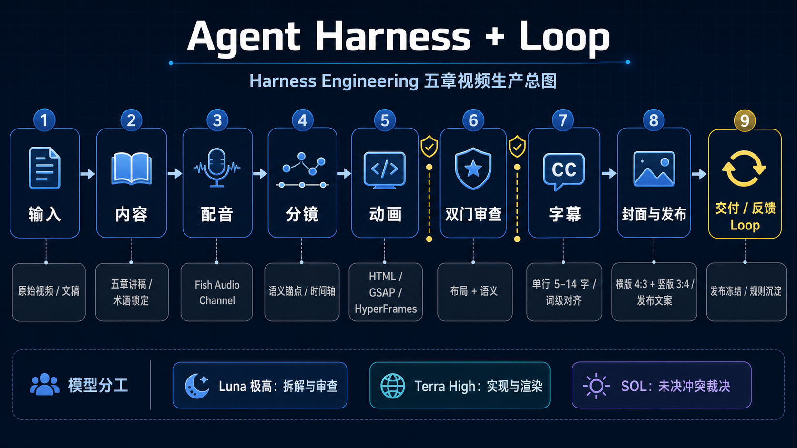
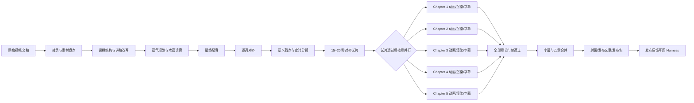

# Course Video Pipeline

把原始视频、访谈或长文，稳定地转成分章 PPT 动画课程、统一配音、精确字幕、封面和发布包。

这个仓库来自一条已经完整发布的五章《Harness Engineering》课程视频。它保存的不是某一条成片，而是可复用的生产方法：先锁定内容与声音，再用真实音频建立语义时间轴，最后做动画、字幕和发布包装。

> 文件夹名称按项目约定保留为 `courseVedio`；仓库与 Skill 的正式名称使用 `course-video-pipeline`。

## 为什么需要这套流程

直接把文稿交给动画模型，最容易出现四类问题：

- 画面按“页面结构”出现，声音却按“语义顺序”推进；
- 动画用估算秒数，配音一改，后面全部错位；
- PPT 在电脑上能看，缩到手机平台后文字过小、字幕遮挡；
- 每次返工直接重做整章，旧图层、旧音轨和新版本混在一起。

本仓库把这些问题拆成内容、声音、语义时间、布局、字幕和发布六组 Harness，并为每一组规定输入、输出、通过标准和失败回路。v06 复盘进一步加入开场 5 秒门禁、真实渲染包围盒门禁、段内词时间归一化，以及章节 fan-out/fan-in 并行规则。

## 总流程





## 仓库结构

```text
courseVedio/
├─ AGENTS.md                         # 仓库内所有 Agent 的总约束
├─ workflow/
│  ├─ course-video-workflow.yaml     # 端到端阶段和交付物
│  ├─ role-routing.yaml              # Luna / Terra / SOL / 人工 / 工具链分工
│  └─ master-harness.yaml            # 全局机器可读质量门禁
├─ docs/
│  ├─ 01_端到端制作流程.md
│  ├─ 02_Harness与返工闭环.md
│  ├─ 03_五章案例复盘.md
│  ├─ 04_课程教学与GitHub使用.md
│  └─ 05_工具执行手册.md
├─ examples/harness-engineering/     # 已完成五章案例的脱敏索引
└─ course-video-pipeline/            # 可安装/复用的 Codex Skill
   ├─ SKILL.md
   ├─ agents/openai.yaml
   ├─ references/
   ├─ scripts/
   └─ assets/project-template/
```

## 快速开始

1. 阅读 [AGENTS.md](AGENTS.md) 和 [端到端制作流程](docs/01_端到端制作流程.md)。
2. 复制 `course-video-pipeline/assets/project-template/`，或运行：

```powershell
python .\course-video-pipeline\scripts\init_course_project.py --output .\work\demo --title "我的课程" --chapters 5
```

3. 按 `workflow/course-video-workflow.yaml` 逐阶段执行，不跳过人工审核点。
4. 运行结构校验：

```powershell
python .\course-video-pipeline\scripts\validate_course_video.py .\work\demo --structure-only
```

5. 内容和媒体完成后，运行完整校验并生成发布包。

## 冻结原则

- `SCRIPT.md` 是内容真相；最终配音是时间真相。
- 动画只能消费已通过的语义时间清单，不能从整段讲稿直接猜秒数。
- 任何旧版、失败音频和试片进入 `PastUselessDoc`，不与当前版本混用。
- 仓库不提交 API Token、个人声纹训练素材、原始数字人视频和大型渲染文件。

## 当前案例

示例是五章《Harness Engineering》，最终合并时长约 7 分 22 秒。详见 [五章案例复盘](docs/03_五章案例复盘.md) 和 [案例索引](examples/harness-engineering/artifact-map.yaml)。

公开发布前请根据你的用途补充合适的开源许可证。
