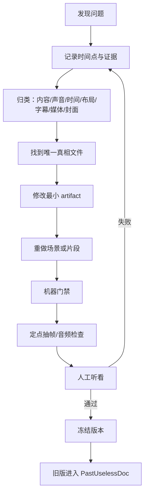

# Harness 与最小返工闭环

Harness 的作用是把“偏好”变成 Agent 可以执行和验收的规则。每条规则都回答四个问题：检查什么、怎样算通过、失败后回到哪里、需要什么证据。

## 六组 Harness

| Harness | 真相文件 | 主要门禁 | 失败回路 |
|---|---|---|---|
| 内容 | `SCRIPT.md` | 受众、结论、事实、版本 | 只改讲稿段落 |
| 声音 | `tone-plan`、最终音频 | 普通话、术语、节奏、单声线 | 重做最小句段 |
| 时间 | `word-alignment`、`semantic-timing` | 词级时间、出现顺序 | 修锚点，不补页面秒数 |
| 画面 | `layout-audit`、动画源 | 字号、安全区、重叠、箭头 | 修最小对象/场景 |
| 字幕 | `subtitle-manifest` | 原文、断句、时间、一行 | 修对齐或字幕组 |
| 发布 | `publish-package` | 封面、裁切、文案、媒体流 | 只修包装或合并 |

本次复盘新增三条硬门禁：

- **开场门禁**：前 5 秒先讲受众问题和白话重构，未解释的架构术语不得提前出现；
- **渲染布局门禁**：必须检查关键帧真实包围盒、字幕安全带、最小字号和禁止交叉，HTML 数值检查不能单独放行；
- **字幕时间门禁**：段内词时间先归一化为 global，再检查词单调性、cue 不重叠、首句起点和 cue/词证据 ≤80ms。

## 最小返工 Loop

## 常见错误的正确返回点

| 现象 | 根因优先检查 | 不应该做 |
|---|---|---|
| 动画比语音慢 | 词级对齐、视觉锚点 | 一直提高模型推理等级 |
| 后面的元素提前出现 | 分镜主角、旧图层时间线 | 给所有元素统一延时 |
| 英文读音不自然 | 术语表、局部配音 | 把全章放慢 |
| 字和箭头重叠 | 实际包围盒与布局 | 把字缩到门槛以下 |
| 字幕断句奇怪 | 语气停顿、完整语义 | 只按 14 字硬切 |
| 字幕挡住 PPT | 字幕安全区与动画终点 | 让字幕更透明来掩盖 |
| 结尾双音轨 | 外部数字人视频音轨 | 重做全部配音 |
| 封面右侧碰边 | 发光/阴影视觉包围盒 | 裁掉边缘 |

## 何时需要 SOL

只有同一个语义冲突在真实时间戳和证据帧支持下，连续两轮仍无法解决时才使用 SOL。输入包括：原句、实际词级时间、当前分镜、问题截图、期望与实际。输出只要冲突点、正确顺序、证据词和时间窗口。

没有真实时间戳时，换强模型也只能给更漂亮的猜测。

## 自动审查与人工审查

机器适合检查：文件存在、YAML/JSON 格式、字号、越界、重叠、媒体流、时长、字幕长度和时间范围。

人工必须检查：语气是否自然、画面主角是否和语义一致、箭头是否真的表达关系、手机端是否容易理解、是否适合发布。

任何自动审查终止都应该输出失败门禁和可继续的最小动作，不能把“任务暂时无输出”直接判成制作失败。

## 并行返工边界

第 1 章试片通过后，各章是独立返工单元：Chapter 3 的箭头问题不应触发 Chapter 1、2、4、5 重渲染。只有章节全部通过后才进入合并；合并失败只修媒体拼接和流映射，不回滚动画。
