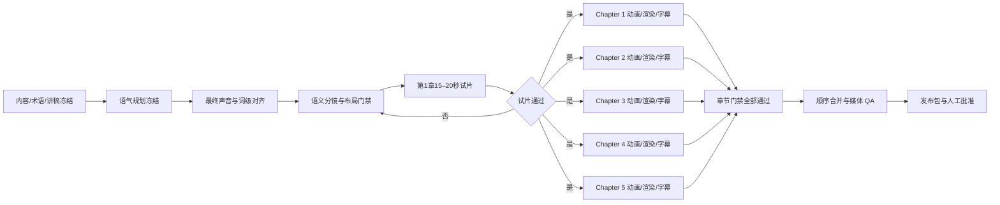

# 五章课程视频复盘：为什么会错，以及哪里可以并行

这次复盘不是把责任归给“模型不够强”，而是检查每个错误在数据流中从哪里产生、在哪个门禁被错误放行。

## 一、三个问题的根因

### 1. 开场白为什么弱

最初的开场直接使用了 `ReAct`、`Multi-Agent` 等架构名词。它在知识上没错，但在教学顺序上错了：观众还没有意识到自己的问题，就先被要求理解术语。

旧 Harness 只有“口播自然”“术语存在”这样的布尔条件，没有检查：

- 前 5 秒是否先提出受众正在经历的问题；
- 是否用白话完成第一层重构；
- 未解释术语是否被提前放入开场；
- PPT 开场标题、副标题、字幕是否与口播一致。

因此模型可以生成“专业但不抓人”的开场，机器仍然判定通过。

现在新增 `opening_hook` 门禁：前 5 秒先给问题/张力，再给白话重构；ReAct、Multi-Agent 等陌生词不得进入开场窗口。

### 2. 第一章为什么会重叠

之前检查的是 HTML 中写入的 `left/top/width/height`，不是浏览器实际渲染后的包围盒。以下因素没有被完整计入：

- 字体真实宽高和中文字形；
- 阴影、描边、发光造成的视觉外扩；
- GSAP 动画中间状态；
- 字幕出现时对底部内容的遮挡；
- 标题、坐标轴、演进面板同时存在时的层级争抢。

所以“源代码没有明显越界”不等于“视频画面没有重叠”。新的规则要求在固定关键帧检查渲染后的 DOM/视觉包围盒，并保留抽帧证据；源代码 regex 只能做辅助门禁。

### 3. 字幕为什么和声音不对齐却通过

替换第二句音频后，Fish Audio 返回的第二段词时间是“相对于该段起点”的局部坐标，而前后段使用的是全局坐标。旧生成器把所有词直接 flatten，导致第二句被从错误位置挑选。

旧字幕门禁只检查：

- `timing_method` 是否写成 `word_alignment`；
- `word_evidence` 是否存在；
- 字幕数量是否匹配。

它没有检查词时间是否是 global、词是否单调、字幕 cue 是否与证据时间真正接近，也没有验证首两句的关键窗口；`alignment_error_ms: 50` 还是固定填入的元数据。

现在生成器会先把段内时间归一化到全局时间，门禁再检查 cue 与词证据的实际差值、重叠、回退和首句起点。

## 二、推荐的并行边界

不能从一开始就把五章完全并行，因为前面有共享真相：讲稿、声音、术语、视觉风格和试片规则必须先冻结。

最稳妥的生产图是：

### 可以并行的环节

1. **最终配音与词级对齐**：讲稿和语气规划冻结后，五章互不共享可变文件，可以按章并行；API 有并发限制时由工具链排队。
2. **语义分镜**：每章使用自己的音频和 `SCRIPT.md`，可以并行生成，但必须在动画实现前统一通过分镜门禁。
3. **动画、逐章渲染、字幕**：第 1 章试片通过后，五章可按 `chapter-XX/**` 独立工作，最多并发 3 章，避免抢占机器和外部 API。
4. **封面和发布文案初稿**：讲稿/视觉规范冻结后可以提前做，但最终发布包必须等合并视频和媒体报告完成。

### 不能并行的环节

- 讲稿定稿与配音冻结：否则每章会围绕不同版本讲话；
- 第 1 章高风险试片批准：它是全章动画模式的样板；
- 五章合并：必须等所有字幕版章节通过；
- 发布批准：必须保留人工最终决定。

## 三、并行执行的文件锁

- 每个工作单元只写自己的 `chapter-XX/`；
- `script/script-approved.md`、`audio/final-narration.wav`、`visual-style.yaml` 进入冻结只读状态；
- `publish-package/video/` 只允许合并阶段写入；
- 失败只重做失败章节或失败句段，不覆盖已通过章节；
- 合并前检查章节版本号、音频时长、字幕版本和 Harness 报告版本一致。

详细机器规则见 `workflow/master-harness.yaml`、`workflow/course-video-workflow.yaml` 和 `content/harness-lessons-v06.yaml`。
